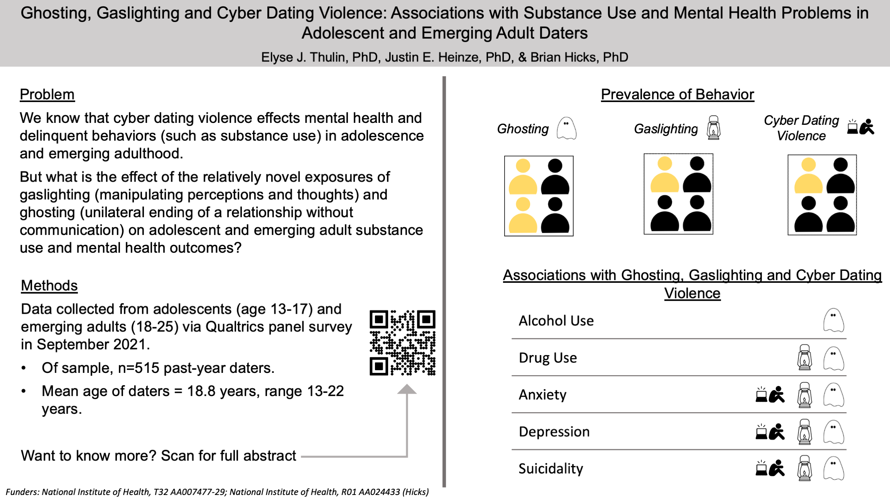

      
<h1> Ghosting, Gaslighting and Cyber Dating Violence: Associations with Substance Use and Mental Health Problems in Adolescent and Emerging Adult Daters </h1>

 Authors: <b> Elyse J. Thulin</b>, PhD, Justin E. Heinze, PhD, & Brian Hicks, PhD
 Gaslighting (manipulating perceptions and thoughts) and ghosting (unilateral, uncommunicated ending of relationship) have been found in adult populations to be associated with worse health outcomes in adults, yet little is known about the association between cyber dating violence (harassment, coercion through technology), ghosting, gaslighting, and mental health and substance use in adolescent (ages 13-17) and emerging adult (18-25) populations. We report the prevalence and overlap of ghosting, gaslighting and cyber dating violence and associations with alcohol use, drug use, and mental health problems in a sample of adolescents and emerging adult prior-year daters (n = 515, mean age = 18.8 years, range = 13-22 years). Half of daters (50.7%, n=261) reported experience with some form of ghosting (i.e., victimization and/or perpetration), 29.1% (n=150) reported experience with gaslighting, and 24.9% (n=128) reported experiences with cyber dating violence. Across the three behaviors, 17.5% (n=90) of daters reported some form of all three behaviors; 7.4% (n=38) reported experience with ghosting and gaslighting but not cyber dating violence; 3.1% (n=16) reported ghosting and cyber dating violence but not gaslighting; 1.7% (n=9) reported gaslighting and cyber dating violence but not ghosting; and 27.8% (n=143) reported only one of the behaviors. Using multivariate regression and controlling for age and relationship status, we found that youth reporting greater alcohol use were more likely to report experiences with ghosting. Participants reporting higher amounts of drug use were more likely to report ghosting and gaslighting. Participants with higher reports of depression, anxiety and suicidal ideation were likely to report all three forms of dating/breaking up behavior. Future work should examine causal direction between dating or breaking up behaviors and health/behavioral outcomes. 

  
 
 		

